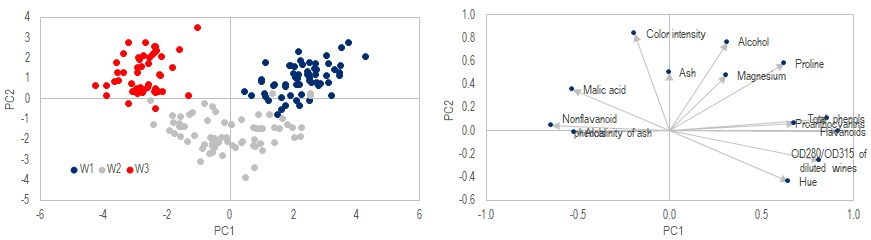
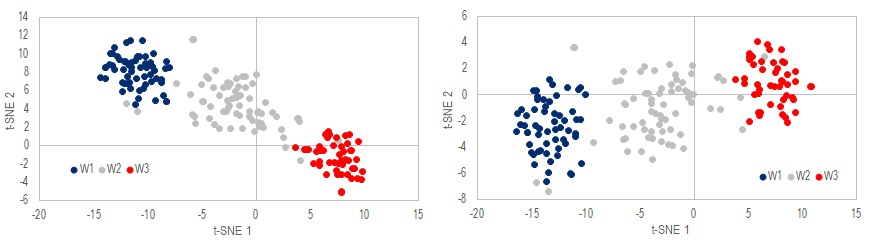
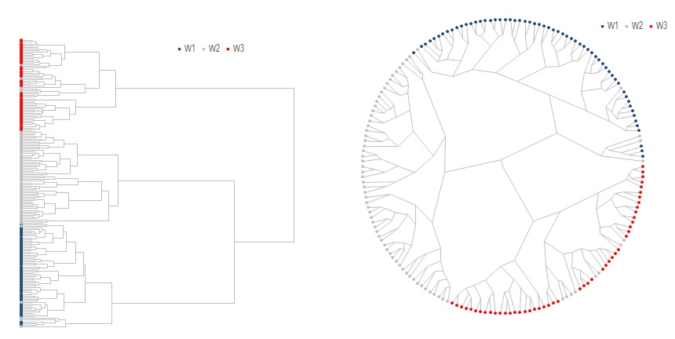
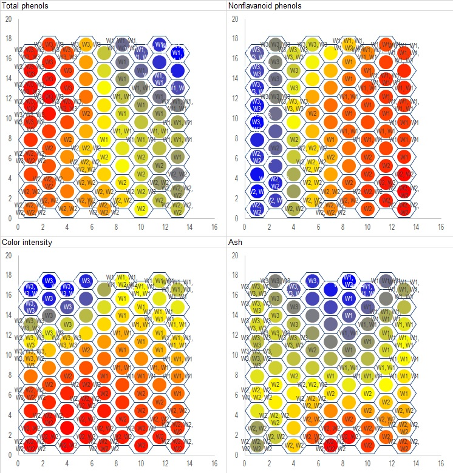
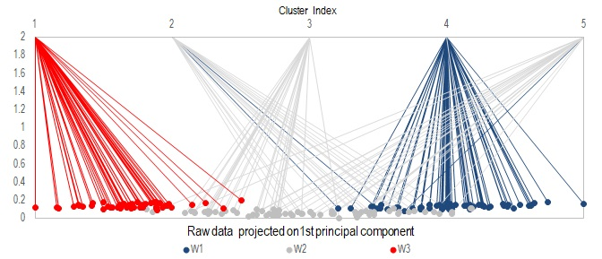
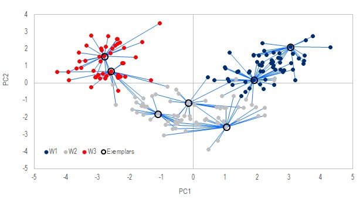

# Scientific Toolkit for VBA

This is a VBA library of basic algorithms commonly used in data analysis. Although there are many state of the art implementations of these algorithms in other languages like Matlab, R or Python, they are not often seen in VBA. While there are good reasons to not use Excel or VBA for these types of analysis, but if you are stuck with Excel either because of budget or IT policy constraints, then hopefully this library can offer a bit of help.

The library is partly written for myself as a learning process, which is why some alogirhtms look redundant and can be replaced by native functions of Excel. I just wrote them for the heck of learning it. This is still an ongoing project and better documentations will come in time.

In this Readme, I will showcase some capabilities of what can be done with the library. The most basic module is modmath.bas, which contains everything from sorting algorithms to matrix decompositions. It will be a prerequisite for every section that follows.

Test data here is wine data set from [UCI Machine Learning Datasets](https://archive.ics.uci.edu/ml/datasets.html)<sup>1</sup>. It consists of 178 samples of wines collected from three different cultivars, which will be named as W1, W2 and W3 in the following sections. 13 attributes of these wine samples were measured.

1. Forina, M. et al. [UCI Machine Learning Repository](http://archive.ics.uci.edu/ml). Institute of Pharmaceutical and Food Analysis and Technologies. 

## Unsupervised Learning

Let's say we are given these sample of wines, without knowing where they are from. So we measure the 13 attributes of these samples, ranging from alchohol content to color intenisty. From the measurements we want to discover possible ways to classified these samples.

First we will import the data, the data should take the form of an array x() of size N X D, where N=178 is the number of samples, D=13 is the number of dimensions. We will also have a vector x_class() of size N that holds the **true class** (W1, W2 or W3) of each sample.

The data usually needs to be normalized in most types of analysis. We will use zero mean and unit varaince in this case. The syntax is:
```
Call modmath.Normalize_x(x,x_mean,x_sd,"AVGSD")
```
Now we are prepared to explore the data in a number of ways:
 - Principal Component Analysis
 - t-SNE
 - Dendogram
 - Self-Organizing Map
 - k-Means Clustering
 - Affinity Propagation

### Principal Component Analysis
Requires: cPCA.cls



```
Dim PCA1 as new cPCA
With PCA1
    Call .PCA(x)                            'Perform PCA transformation
    x_projection=.x_PCA(2)                  'output projection of original data onto the first two components
    Call .BiPlot_Print(Range("I3"), 1, 2)   'output biplot of components 1 & 2
End with
```
The method .PCA performs a transformation on x. The transformed data can then be extracted with method .x_PCA. In this case the first 2 components are saved to x_projection, which is shown in the left chart above. We also output the biplot of PC1 and PC2 to cell I3, which can be chart in Excel in a normal way, shown on the right hand side.

Note that the data are color coded above to show the 3 true classes, to aid our evaluation on how well this method works. In a real life situation, we may not know what the true classes are, and one needs to manually define where they want to "slice" the dataset.

### t-SNE (t-Distributed Stochastic Neighbor Embedding)
Requires: ctSNE.cls, cqtree.cls, cqtree_point.cls, mkdtree.bas



While PCA is very simple and efficient, it has limited use when the varaibles are not-linearly related. In that case t-SNE maybe a better option.
```
Dim TS1 As New ctSNE
With TS1
    Call .tSNE_BarnesHut(x, 2)  'Perform t-SNE on raw data onto 2-dimension plane
    y = .Output                 'Output 2D projection of data
    z = .cost_function(True)    'output cost function to see convergence
    Call .Reset                 'release memory
End With
```
There are two methods in this class to perform transformation: .tSNE or .tSNE_BarnesHut. .tSNE is the simplest implementation of the algorithm but can be quite slow. .tSNE_BarnesHut uses a quadtree data structure to speed up the process when number of sample N is huge. When N is small, the overhead cost of BarnesHut may not be worth the effort. But for large N~1000 , BarnesHut is essential for a resonable excecution time. The method .Output extract the transformed data which is plotted in the above figures.

Note that random initialization is implemented, and different realizations will converge to different results even when the same hyperparameters are used. The two figures above are two different runs. Although the charts look different, they both produce similar relative ordering.

### Hierarchical Clustering
Requires: cHierarchical.cls



```
    x_dist = modMath.Calc_Euclidean_Dist(x, True)   'Pariwise Euclidena distance matrix
    Dim HC1 As New cHierarchical
    With HC1
        Call .NNChainLinkage(x_dist, "WARD", x_class)   'Construct dendogram with Ward's method
        Call .Optimal_leaf_ordering                     'reorder leaf
        Call .Print_Tree(.Range("A2"))               'Print dendogram in normal retangular form
        Call .Print_Tree(.Range("J2"), 2, True)      'Print dendogram in polar form
        .Reset
    End With
    Set HC1 = Nothing
```
Then input to this class is a pairwise distance matrix instead of the raw data. We use Euclidean distance here which is calculated using modMAtch.Calc_Euclidean_Dist. The denogram can be built with either .Linkage or .NNChainLinkage as shown above. The only difference is that .NNChainLinkage uses Nearest-Neighbor-Chain to speed up the construction process.

An additional and optional processing step is to reorder the leaves using either .Optimal_leaf_ordering or .MOLO, to flip each subtree such that similar leaves are more likely to be shown together.

Once done .Print_Tree can be used to print the the data in Excel and chart with scatter charts. A polar embedding version of the dendogram is also available, which in some cases may be more aesthetically pleasing. Notice how the 3 distinct branches correspond the the 3 true classes.

### SOM (Self-Orgainzing Map)
Requires: cSOM.cls



```
    Dim SOM1 As New cSOM
    With SOM1
        Call .Init(9, 10, 13)          'Initialize a 9 by 10 hexagonal grid of nodes in 13 dimension
        Call .SOM_Hex_Train(x)         'Train the network on raw data
        Call .Get_Node_Labels(x_class, node_labels)   'Generate data labels to print on each node
        Call .Print_All_Dimensions(mywkbk.Sheets("SOM"), , , , True, node_labels, factor_labels) 'Create the charts
        Call .Reset
    End With
    Set SOM1 = Nothing
```
The algorithm of SOM itself is rather simple, much of the codes is actually dedicated to drawing the charts since Excel does not directly support plotting on hexagonal grid.

In the sample above .Init is used to initialize a 9 by 10 grid, which is chosen heuristically -  assuming 90 nodes for 178 samples means about 2 samples assigned to each node.
.SOM_Hex_Train does the actual training and assign each datum to its appropriate node.
.Get_node_labels is used to generate node_labels() which can be printed on each node, which is simply a comma-separated list of data points assigned to that node. In cases where a node has too many members, the label may become too long and cannot be shown on a chart. In that case you will need to devise your own way to generate the labels or simply note showing them at all.
.Print_All_Dimension will then create charts on selected Excel worksheet.

Only four out of thirteen attributes are shown above. Wines from W1 are mostly placed on the upper-right portion of the grad, W3 on the upper-left, and W2 occupies the lower-half. Compare these to the biplot in the PCA section to see how they rhyme with each other.

### k-Means Clustering
Requires: ckMeanCluster.cls

So far the above methods only provide aids for you to see how you may slice the data, and which attribute is more relevant in classification than the others. In contrast, k-Means clustering directly separate samples into pre-specified number of clusters.



```
    Dim kM1 As New ckMeanCluster
    With kM1
        Call .kMean_Clustering(x, 5) 'Divide data into 5 clusters
        cluster_index = .x_cluster   'Integer vector of size N, holding the cluster assigment
    End With
```
Use method .kMean_Clustering to divide the samples into desired number of clusters. In the example here, let's pretend we do not know there are 3 true classes, and attempt to classify them into 5 groups. The cluster assignment is then returned by .x_cluster as an integer vector of size N, with values from 1 to 5.

In the above figure, I arranged the data according to their first principal component, color-coded them and used lines to visualize their mapping to the 5 resulting clusters. You can see that samples from the same true class tend to get assigned to the same cluster, which is good. But a few samples from class W1 are assigned to cluster 2, which is dominantly occupied by samples from W2. When you combine this with the PCA analysis, you will notice these "incorrectly" assigned samples are the ones who lie near the boundary of transition from W1 to W2.

Note that k-Means clustering is implemented here with random initialzation, so multiple runs can result in different cluster assignments.

### Affinity Propagation
Requires: cAffinityPropagation.cls



```
    x_dist = modMath.Calc_Euclidean_Dist(x, True)
    For i = 1 To n_raw - 1
        For j = i + 1 To n_raw
            x_dist(i, j) = -x_dist(i, j)
            x_dist(j, i) = x_dist(i, j)
        Next j
    Next i
    Dim AP1 As New cAffinityPropagation
    With AP1
        Call .Affinity_Propagation(x_dist, , , , "MIN")
        Cluster_index = .Exemplar_index
        Exemplar_List = .Exemplars
        k = .Exemplar_num
        Call .Reset
    End With
    Set AP1 = Nothing
```
The input to this class is a pairwise similarity matrix. in this case we use the negative of Euclidean distance.
Method .Affinity_Propagation is the main procedure that finds out which data points are the "exemplars", i.e. members that are the most represtative of their groups. .Exemplars return an integer vector that hold the points to which data is an exemplar. .Expemplar_index returns an integer vector of size N that holds the exemplar assigned to each data point.

The exemplars here are similar to the cluster centers in k-Means method above. But unlike k-Mean, the number of exemplars are not prespecified but dsicovered on the fly. The number of exemplars discovered is affected by the choice of the fith argument in .Affinity_Propagation, which can be "MIN", "MAX" or "MEDIAN". You may refer to [Frey, 2007](http://www.psi.toronto.edu/affinitypropagation/FreyDueckScience07.pdf)<sup>2</sup> to understand what that means.

In the figures above, the samples with black circles around them are discovered as the exemplars, and the lines map out the samples assigned to each of these exemplars. The 2D mapping was done in PCA, notice how each exemplar tends to sit at the center of its group.
